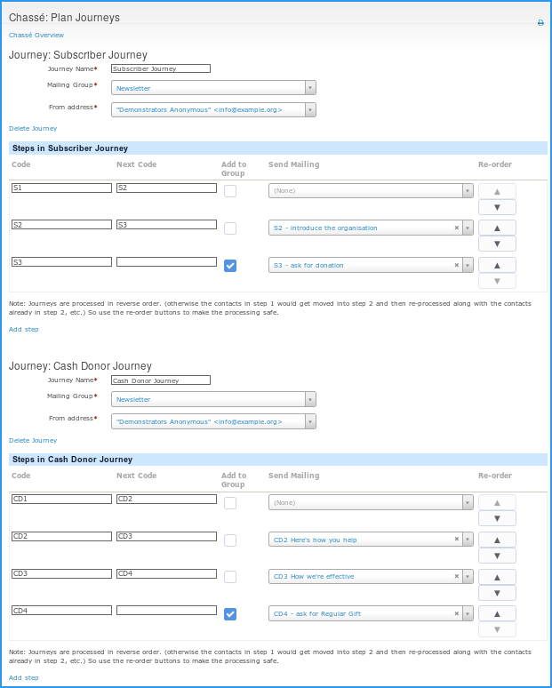
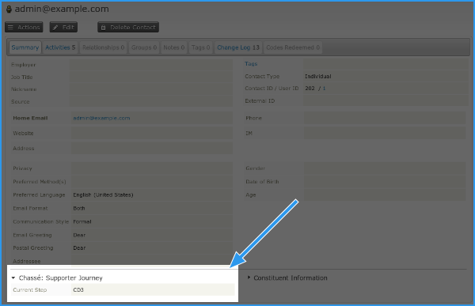

# chasse

    

Get your supporters chassé-ing through an email-driven donor journey to improve your organisation's onboarding experience.

The concept is that each contact can be at a particular stage of one of a set of journeys. So you might have a journey for new people to your email list, and a journey for first time donors and a journey for regular givers.

A "journey" is here simply means they'll get sent a series of emails as they "step" forward. Or chassé.

The system can be **automated** so that people bump along without you clicking anything.

See the original client requirement below for an example.

The extension is licensed under [AGPL-3.0](LICENSE.txt).

## Requirements

* PHP v7+
* CiviCRM (*5*.x)

## Installation (Web UI)

This extension has not yet been published for installation via the web UI.

## Installation (CLI, Zip)

Sysadmins and developers may download the `.zip` file for this extension and
install it with the command-line tool [cv](https://github.com/civicrm/cv).

```bash
cd <extension-dir>
cv dl chasse@https://github.com/artfulrobot/chasse/archive/master.zip
```

## Installation (CLI, Git)

Sysadmins and developers may clone the [Git](https://en.wikipedia.org/wiki/Git) repo for this extension and
install it with the command-line tool [cv](https://github.com/civicrm/cv).

```bash
git clone https://github.com/artfulrobot/chasse.git
cv en chasse
```

## Example use case

**Hint**: You should find a link to **Chassé Supporter Journeys** under the **Mailings** menu, once this is installed.

When people sign up for our email newsletter, instead of just chucking them on the list with everyone else, we want to send them a particular email each week, so we can welcome them, introduce what we do, and finally, give them the opportunity to make a cash donation. At the end of these 3 weeks the contact is moved to the main newsletter group and receives that along with everyone else.

If they do give a cash donation, we want put them on a new 4 week journey, at the end of which we'll ask them for a regular gift. Again, if they don't take up that opportunity they'll just go onto the newsletter list as normal.

Of course people may choose to unsubscribe at any time and we must stop their journey right away if that happens.

We'll give codes to all the stages: S1..S3 for the **s**ubscriber journey, CD1..CD4 for the **c**ash **d**onor journey. And we set up message templates for each of the steps.

We put these plans into the extension:



We created 2 journeys. Each journey has:

- a name (just for your reference)

- a mailing group (used as the "unsubscribe group" for mailings)

- a From email address

And then steps in that journey:

1. We assume that some other online system has plonked the new would-be subscriber in our CRM, sent them a thanks/confirmation and set their journey status to S1. So the S1 step simply says that the next step should be S2.

2. Step S2 says that we should send a particular mailing, then move them up to step S3

3. Step S3 says send the mailing, then add them to the mailing group, and that's the end of the journey, so the next code is blank.

The second journey is basically the same but with another step.

The status page shows it more succinctly:


## Processing along

You can hit the Process Now button to force a process along, but normally you would use a **weekly Scheduled Job** to trigger the process. You can process a single step, a single journey, or all journeys.

The API calls to do this are:

- Chasse.step - all journeys

- Chasse.step journey=1 - just the 2nd journey (journeys are zero indexed, so 0 is the first one)

- Chasse.step journey=1 step=CD4  - But the only reason to do a single step is for testing.

You can see the results of the processing in the usual places:

- The Sent/Scheduled mailings screen.

- The contact records - the groups tab; the activities tab; and the new journey step field:   
  

## Unsubscribing

In CiviCRM, a contact can be in one of three states in relation to a group:

1. subscribed

2. removed

3. neither subscribed nor removed.

This extension assumes it's OK to mail people on a journey unless they're **removed** from the configured mailing group. So you obviously need to take care with your entry-point systems that put people on the journey to begin with that you have consent to do this (suitable to the law of your land, e.g. GDPR).

When someone unsubscribes from the mailing group used by one of these mailings, if they have a journey status that belongs to a journey that uses that mailing group, their journey step field is set empty. Because of this, they won't ever get to the "add to group" last step in our example, so they won't get added back in.


## Technical documentation

### Configuration


    {
      next_id    : 124,
      journeys   : {
        journey1    : <journey_def>,
        journey123  : <journey_def>,
        <journeyid> : <journey_def>,
        ...
      },
    }

- `next_id` ensures new journeys have unique ids, e.g. here the next journey id
  will be `journey124`

- `journeys` is an array of journey definitions (see below), keyed by journey id

A `<journeydef>` looks like:

     'name'          : 'Admin name of journey',
     'id'            : 'journey1',
     'mailing_group' : 123,
     'mail_from'     : <from_id>,
     'schedule'      : <schedule>,
     'steps'         : [ <stepdef>, <stepdef>, ... ]

If `schedule` is not present, then this journey will NOT be run by the
scheduler. i.e. original functionality.

A `<schedule>` is an array of constraints, keyed by the type of constraint. Only
the relevant constraints should be present. An empty array means run every time.

    {
        'days'          : [1, 3, 7], // ISO-8601 1=Monday, 7=Sunday.
        'day_of_month'  : 1,
        'time_earliest' : '09:00', // 24 hr format.
        'time_latest'   : '23:00',
    }


A `stepdef` looks like:

    {
        'code' : 'S1',
        'next_code' : 'S2',
        'send_mailing' : $this->msg_tpl_1,
        'add_to_group' : '',
        'interval' : <interval>
    },

- `code` is a unique code used by admins. Nb. it must be unique across all
  journeys.

- `next_code` is what to set a contact's step field to after processing this
  step. It's either blank (no next step, end of journey) or the code of the
  following step.

- `send_mailing` is the message template ID of the mailing to send, or blank for
  not to send a mailing.

- `add_to_group` if truthy ('1') then after processing this step contacts are
  added to the group that is specified in the journey's config.

- `<interval>` is missing, blank, or an SQL valid interval like "7 DAY".

## Release notes

### v2

Breaking changes:

If you had any code that called the Chasse.step API using `journey_index` you
now need to update this to use `journey_id`. Journey indexes were problematic -
delete journey 0 and now journey 0 would be what used to be journey 1.

After initial upgrade journey id will be 'journeyN' where N is the old journey
index. But after changing journeys there may be different numbers so look them
up before writing them into scripts.
