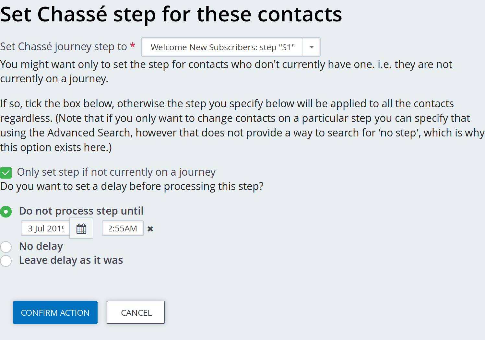

# How to start people on a journey

This page describes tools provided that you can use to support your
organisation's "business logic" for who should go on what journey and when.

Chassé does not put contacts on its journeys, it just deals with progressing
contacts once they are on a journey. But it provides some tools and helpers.

## Warning: it can get complex!

Oftentimes organisation's logic gets pretty complex and would be dealt with by
some custom code that carefully handles your all organisation's situations.

e.g. "when they sign up for our email newsletter on our website they should go
on the newsletter welcome journey" - sounds simple?

* What if they're already on the newsletter list?

* What if they're already on the newsletter welcome journey?! (General rule
  when dealing with people and systems is that if something is possible it will
  happen whether or not it makes sense!)

* What if they're already on a (more valuable) "regular donors journey"?

You must make sure your logic makes sense and your systems handle all the
unlikely "edge cases" as well as the simple majority case.

## Understanding unsubscribing

It's your responsibility to uphold data protection. Therefore it's important to
understand how this extension processes your data. (It's also a good place to
remind you that this software is provided without any warranty or guarantee and
that the author(s) cannot be held responsible for anything that happens as a
result of using it.)

In CiviCRM, a Contact can be in one of three states in relation to a Group:

1. added

2. removed

3. neither added nor removed

!!! note "Key concept"
    This extension assumes it's OK to mail people on a journey unless they're
    **removed** from the configured mailing group.

So you obviously need to take
care with your entry-point systems that put people on the journey to begin with
that you have consent or other suitable legal basis to do this (suitable to the
law of your land, e.g. GDPR).

When someone unsubscribes from the mailing group used by one of these mailings,
if they have a journey status that belongs to a journey that uses that mailing
group, their journey step field is set empty. Because of this, they won't ever
get to the "add to group" last step in our example, so they won't get added back
in.

## Custom code

Just use the standard `Contact.create` API to set the custom step and "not
before" Chassé fields.

## Manually putting a contact on a journey

You can edit someone's record and set a step (and a "not before" date/time).

## Bulk

You can run a contacts search and use the **Chassé - set journey step** search
task.



Hopefully that screen is self explanatory.

Nb. you could also use CiviCRM's built in Profile functions to bulk update
contacts' steps, although this gets unwieldy with many contacts.

## CiviRules Action

A [CiviRules](https://civicrm.org/extensions/civirules) action is provided to
put people on a step. You can use CiviRules' normal conditions to help identify
situations when that rule should fire; e.g.  specifying "Chasse step is blank".

!!! warning

    This action will only be available if Chassé was installed *after*
    CiviRules. See below if you are installing CiviRules after Chassé.

### Manually installing the CiviRules action

Chassé will normally create the CiviRules action when it is installed (or
upgraded from v1) if CiviRules is installed, but if that didn't happen you can
install it manually using the following API call:

```bash
cv api CiviRuleAction.create name=chasse_set_step \
   class_name=CRM_CivirulesActions_ChasseSetStep \
   label="Set Chassé step" \
   is_active=1
```

You can, of course, call this API from **Support » Developers » API Explorer**,
with the same parameters too.
